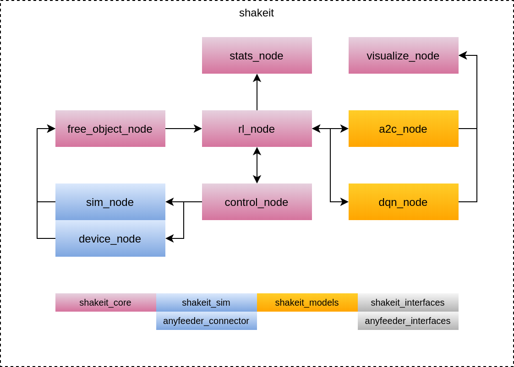

# Shakeit!


## Docker

### Build

```powershell
docker build -t shakeit .
```

### run

To run not headless on windows, make sure to have an XServer running see [example](https://github.com/SHOP4CF/moni2#windows-wsl-2). Run this one line

```powershell
$shakeip = Get-NetIPAddress -InterfaceAlias "vEthernet (WSL)" | select -exp "IPAddress"; docker run -it --rm --name shakeit -e DISPLAY=${shakeip}:0.0 shakeit ros2 launch shakeit_experiments run_sim_experiment.launch.py
```

Run with dokcer-compose together with moni2, remember to set DISPLAY_IP in .env and to run the command in the same folder as docker-compose.yml
```powershell
docker-compose up
```


## Requirements/dependencies
* ROS2
* [CoppeliaSim, plugin for ROS2 and PyRep](ros_pkg_ws/src/shakeit_sim/README.md)

### Configure ROS
In ~/.bashrc define environment variables for your ROS2 installation, e.g:
```
export ROS_VERSION=2
export ROS_PYTHON_VERSION=3
export ROS_DISTRO=foxy

source /opt/ros/foxy/setup.bash
```
Source ~/.bashrc
```
$ source ~/.bashrc
```

### Install dependencies
```
$ cd ros_pkg_ws
$ sudo apt install python3-wstool
$ sudo apt-get install python3-rosdep2
$ rosdep update
$ wstool init src/ src/src_dependencies.rosinstall --shallow
$ rosdep install --default-yes --ignore-packages-from-source --from-path ./src
``` 

NOTE: If the rosdep update gives errors change the following export in the bashrc file (Solution found here [rosdep error](https://github.com/ros-infrastructure/rosdep/issues/576))

Replace the following line:
```
export LD_LIBRARY_PATH=$LD_LIBRARY_PATH:$COPPELIASIM_ROOT
```

with the following:
```
export LD_LIBRARY_PATH=/usr/lib/x86_64-linux-gnu:$LD_LIBRARY_PATH:$COPPELIASIM_ROOT
```


### Build

Install Colcon
```
sudo apt install python3-colcon-common-extensions
```

Check how to source Corppelia stuff: `ros_pkg_ws/setup.bash_example`

```
$ cd ros_pkg_ws
$ source setup.bash
$ colcon build
```

If you're not using CoppeliaSim skip the sim packages by:

```
colcon build --packages-skip sim_ros2_interface
```

Now go into the launch file and edit the path in [L24](http://robotgit.localdom.net/ai-box/applications/shakeit/-/blob/master/ros_pkg_ws/src/shakeit_experiments/launch/run_experiment.launch.py#L24)
to the path of the src folder in this repo.

### Pycharm
To open PyCharm with code-completion and imports working:
```
$ cd ros_pkg_ws
$ source setup.bash
$ pycharm
```

## Packages
* [shakeit_core](ros_pkg_ws/src/shakeit_core/README.md): contains basic functionality
* [shakeit_interfaces](ros_pkg_ws/src/shakeit_interfaces/README.md): common messages, services, and actions for the shakeit-project
* [shakeit_models](ros_pkg_ws/src/shakeit_models/README.md): models used for training and prediction
* [shakeit_sim](ros_pkg_ws/src/shakeit_sim/README.md): simulation of the vibration feeder
* 

## Notes
Link to sensopart camera pc-software [here](https://www.sensopart.com/en/service/downloads/90-visor-pc-software/)


