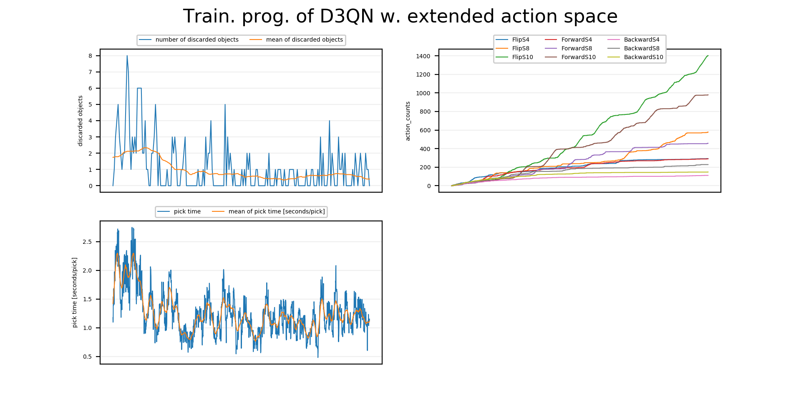

# Shakeit core

## Control Node
The `control_node` have the following internal loop:
```python
while True:
    while free_object_node.get_free_objects():
        rl_node.separate_objects()
    robot.pick()
``` 

## RL Node:
The RL_Node have an action `separate_objects(timeout: int, ) -> bool`, 
which generally will run the following code:    
```python
def step(action):
    shaker_action = convert_action(action)  # Convert action if needed
    shaker.perform_action(shaker_action)    # use the shaker
    state = get_observation()               # call observation_node
    reward = get_reward()                   # call reward_node
    done = len(get_free_objects()) or ts > timeout  # call free_object_node
    return state, reward, done

state_1 = get_observation()                # call observation_node
while True:
    action = model.predict(state_1)
    state_2, reward, done = step(action)
    model.update(state_1, reward, state_2)
    if done:
        break
    else:
        state_1 = state_2
```

## Free Object Node
FreeObjectNode provides a service`/free_object_node/free_objects, {} -> {empty: bool, count: int, points: shakeit_interfaces/Point[]}`;
which takes the latest retrieved image from the camera publisher and calculates a list of object poses. 
The list is empty if no objects are pickable.

## Visualize Node
  
Constructs a figure which is dynamically re-drawn based on messages incoming to `/visualize, shakeit_interfaces.Plot` topic,
where `shakeit_interfaces.Plot = dict(timestamp=int64, value=float32, key=string)` . Plots are synchronized based on timestamp,
and automatically scaled in y-axis for a better visual experience. The visualizer also calculates averages for each `key` separately.